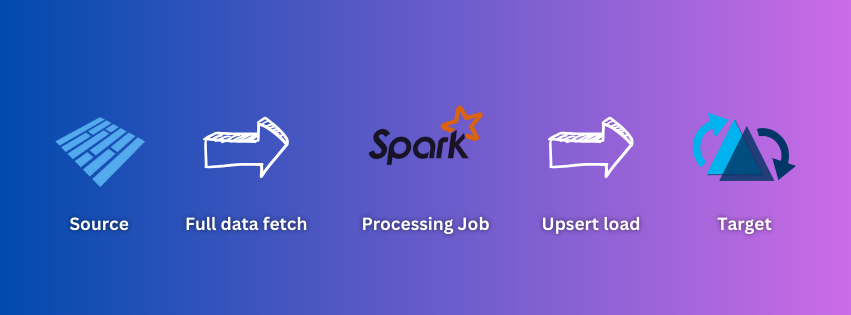

# ETL processes for managing Apache Hudi Lakehouse

## Overview

This repository contains various data ingestion and processing workflows designed to handle diverse data sources to manage a Apache Hudi lakehouse architecture.  
The processes include data ingestion from multiple processes,CDC (Change Data Capture), and clustering for solving problems related to small files.

## ETL Processes

### 1. [Ingestion from Parquet Source](./Ingestion%20from%20Parquet%20Source/)
- **Description:** Ingesting parquet files from a source to an Apache Hudi table.

  

### 2. [Ingestion from CSV Source](./Ingestion%20from%20CSV%20Source/)
- **Description:** Ingesting CSV files from a source to an Apache Hudi table.

  

### 3. [Incremental Pull from Postgres](./Incremental%20pull%20from%20Postgres/)
- **Description:** Fetching latest data inserted/updated in a Postgres table into an Apache Hudi table.

  

### 4. [Ingestion from Kafka Source](./Ingestion%20from%20Kafka%20Source/)
- **Description:** Fetching data from a Kafka topic to an Apache Hudi table.

  

### 5. [Ingestion from Kafka Source using SchemaRegistry](./Ingestion%20from%20Kafka%20Source%20using%20SchemaRegistry/)
- **Description:** Fetching data from a Kafka topic to an Apache Hudi table, also managing the schema for the Kafka topic in a registry making the process more manageable.

  

### 6. [Ingestion from Multiple Homogeneous Sources](./Ingestion%20from%20Multiple%20Sources/)
- **Description:** Apache Hudi job to ingest data from multiple homogeneous sources at a time, in this case, reading multiple CSV files.

  

### 7. [Apache Hudi Continuous Mode Ingestion and using Transformer while loading](./Continuous%20mode%20and%20transformer/)
- **Description:** Apache Hudi job scanning for changes in the source periodically and ingesting data from the source as well as applying light transformation while loading using transformer.

  

### 8. [Ingestion from Hudi Source](./Ingestion%20from%20Hudi%20Source/)
- **Description:** Creating a silver data layer from a bronze data layer of Hudi tables.

  

### 9. [Load to MinIO](./Load%20to%20MinIO/)
- **Description:** Managing the datalake on a MinIo platform, making it similar to loading the data on AWS S3.

  

### 10. [CDC Load from Logs](./CDC%20load%20from%20logs/)
- **Description:** Change data capture pipeline, utilizing Debezium and Kafka connector to fetch the updated data from a Postgres instance and update on the Apache Hudi lakehouse.

  

### 11. [Async Clustering - Removing Small File Issue](./Async%20clustering%20-%20Removing%20small%20file%20issue/)
- **Description:** Asynchronous Apache Hudi job to address the small file issue, improving read efficiency for Hudi tables.

  

### 12. [Generic Multi-Table Postgres Ingestion](./Generic%20Multi-table%20Postgres%20Ingestion/)
- **Description:** Generic code for loading multiple postgres tables in incremental mode to Apache Hudi.

  

## Prerequisites:

1. Install Java: `brew install openjdk@11`
2. Install Hadoop: `brew install hadoop`
3. Set the appropriate PATH in environment variables
4. Install all the packages: `pip install -r requirements.txt`
5. Download the jars for Apache Hudi and keep them in a folder called 'jar' in this directory

    Hudi Version 0.15.0
    https://mvnrepository.com/artifact/org.apache.hudi/hudi-utilities-slim-bundle_2.12/0.15.0

    Hudi Version 0.14.0
    https://repo.maven.apache.org/maven2/org/apache/hudi/hudi-utilities-slim-bundle_2.12/0.14.0/